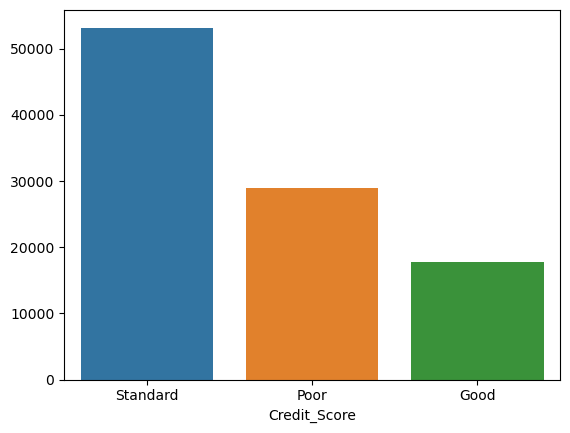

# Practicum - Loan Defaulter Prediction in Credit Scoring Context using XAI techniques

 <!-- Samar - please explain the code and output briefly ( can mention in the final paper ) -->

### Our Methdology ###
@Samar 

### Datatset Description ###
 Questions:
 1) Why should we remove - 'ID','Customer_ID','SSN','Name' ???
-  Based on the literature review and the kind of info they describe they do not pay a significant contribution in the model performance and in the study overall.

###  EDA ### 

# EDA
1) Distributions : From the probplots we can conclude that most of the variables are normally distributed with little skewness (Both in Train and Test Sets).

2) Outliers are handled by normalizing - StandardScaler

3) Sampling Technique used - SMOTE and Random 
@Samar - please update the increase in proportion of datapoints in the overall training set.

4) Transformations Explained::
        :: 'Payment_Behaviour' that likely combined loan type and payment details.
        :: transformed this column to create separate features:'Type_of_Spent' (indicating what was purchased) and   'Payment_type' (containing information about the payment method).
        :: Instead of One Hot Encoding (increasing unnecessary dimensions) created new columns in your dataset, each representing a specific loan type: payday_loan, mortgage_loan, credit_builder_loan, auto_loan, student_loan, debt_consolidation_loan, not_specified, personal_loan, and home_equity_loan.

 ###### Feature Selection ########

@Samar : for feature selection =

        need to decide among this ::
            1) STEP
            2) CORR
            3) CHI-SQUARE
            4) GINI INDEX / INFORMATION GAIN (Since we are using Tree based algorithms)
            5) VIF
             

### Code explainatin ###

#### Classification Models ####

# A Credit Scoring Ensemble Framework using Adaboost and Multi-layer Ensemble Classification

BASE - (NB, SVM, ETC, KNN , DTC, RF) >>>> CLASSIFIER RANKING >>>Layered ADB

# Comparative Analysis of Bank Loan Defaulter Prediction Using Machine Learning Techniques

BASE - RF

# An Ensemble Classifier Model to Predict Credit Scoring – Comparative Analysis

Base Classifiers 
Decision Tree (DT),Support Vector Machine (SVM), K-Nearest Neighbour Algorithm (k-NN),Multilayer Perceptron (MLP) and Naïve Bayes classifier (NB) 

Ensemble Classifiers
Random Forest (RF),Bagged Decision Tree, ExtraTreesClassifier(ETC), Adaboosting, Gradient Boosting (GB) and Voting Ensemble (LR+DT+SVM)

# A Triplet Deep Neural Networks Model for Customer Credit Scoring

Triplet DNN

### We can display Rankings of Comparative analysis with different Feature Selection techniques used !

### for XAI reference 

paper : Why should I trust you! Marco Riberio / Sameer Singh

can we plot a Partial Dependency Plot? 

### Related Research ### 

(Jabeen et al., 2023; Parekh et al., 2021). - Random Oversampling and Random Undersampling
